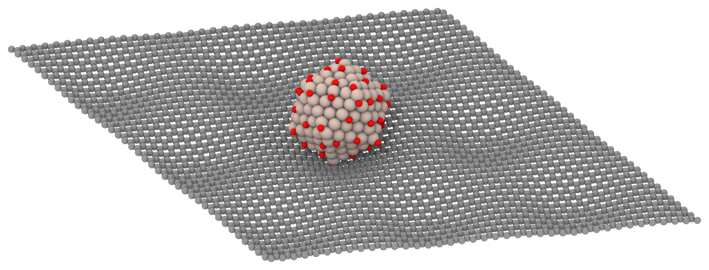
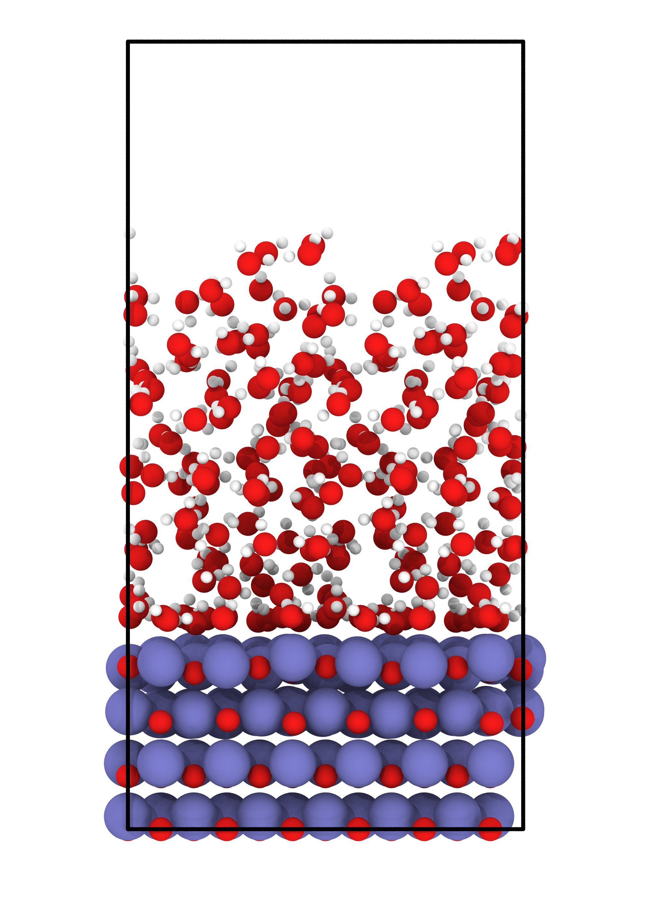
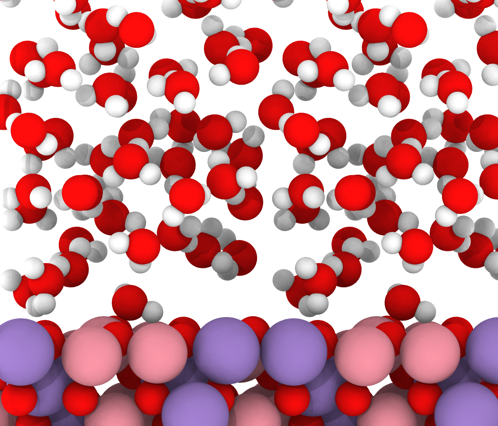

# agent-skills

AI agent skills for computational chemistry and materials science research.

Built for [Claude Code](https://claude.ai/code), but the core scripts are LLM-agnostic Python.

## Installation

Just tell Claude Code:

> "Install all skills from https://github.com/JinukMoon/agent-skills into my skills."

Claude Code will clone this repo and copy the skills to `~/.claude/skills/`.

Each skill's `SKILL.md` contains its own setup guide (Python dependencies, renderer selection, etc.).

## Available Skills

| Skill | Description |
|-------|-------------|
| [structure-visualizer](skills/structure-visualizer/) | Render atomic/molecular structures as publication-quality PNG (OVITO Tachyon / POV-Ray) |
| [pptx-to-pdf](skills/pptx-to-pdf/) | Convert PPTX to high-fidelity PDF via Windows PowerPoint COM (7K rasterized slides) |
| [paper-reading](skills/paper-reading/) | Deep-read a scientific paper PDF and produce full Korean translation + critical review |

## Examples (structure-visualizer)

### Molecules

| H2O | NH3 | CH4 | CO2 | C2H6 |
|:---:|:---:|:---:|:---:|:---:|
|  |  |  |  |  |

| C2H4 | C6H6 | CH3OH | HCOOH | CH3CHO |
|:---:|:---:|:---:|:---:|:---:|
|  |  |  |  |  |

### Slabs & Surfaces

| Ru55O20 / graphene | Ru309O52 / graphene |
|:---:|:---:|
|  |  |

| ZnO + water | Co2MnO4 + water |
|:---:|:---:|
|  |  |

## License

MIT
