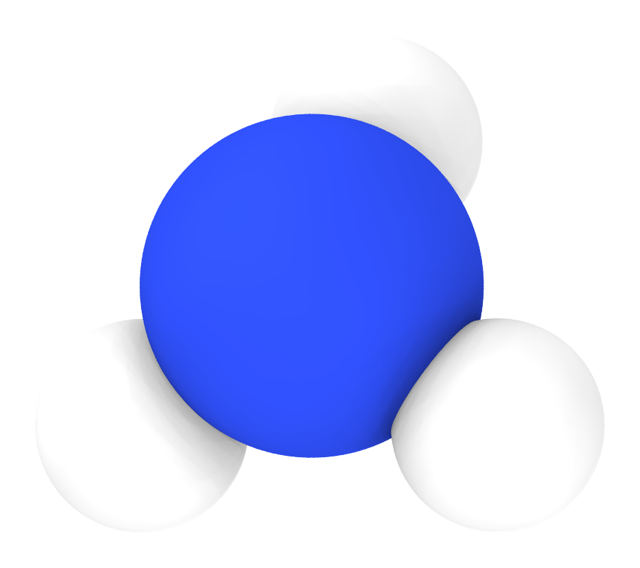
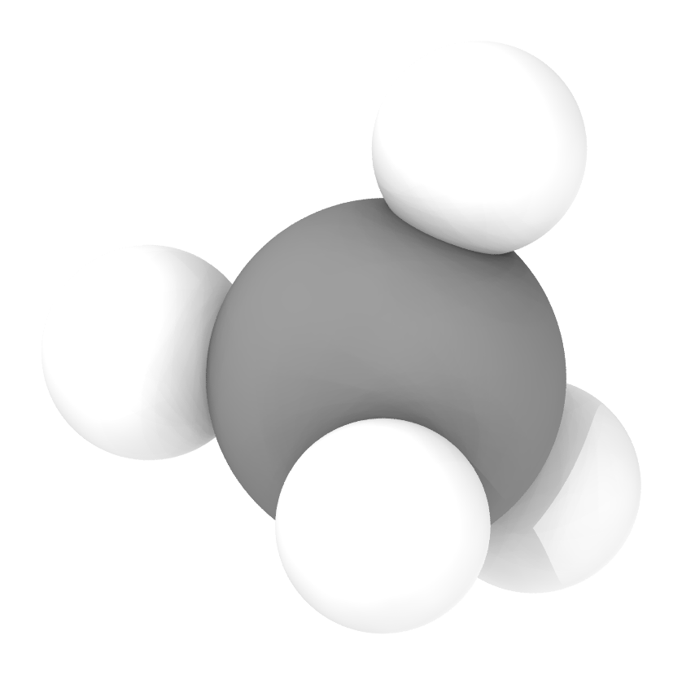
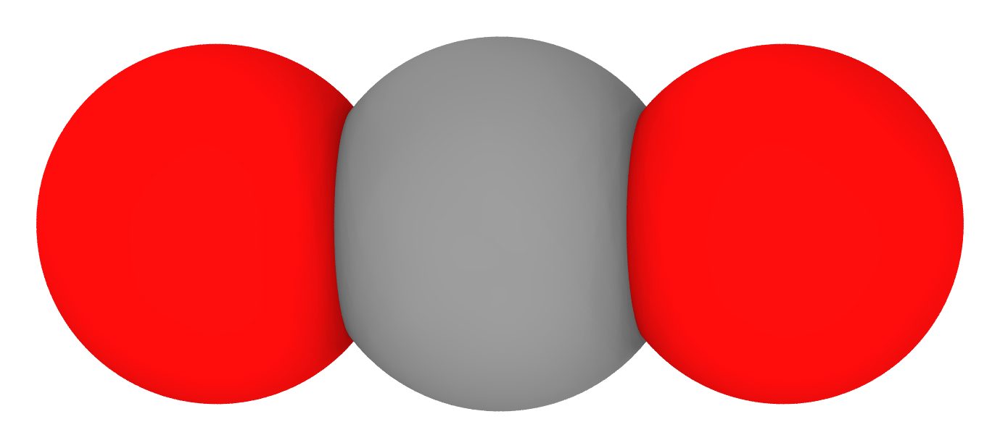
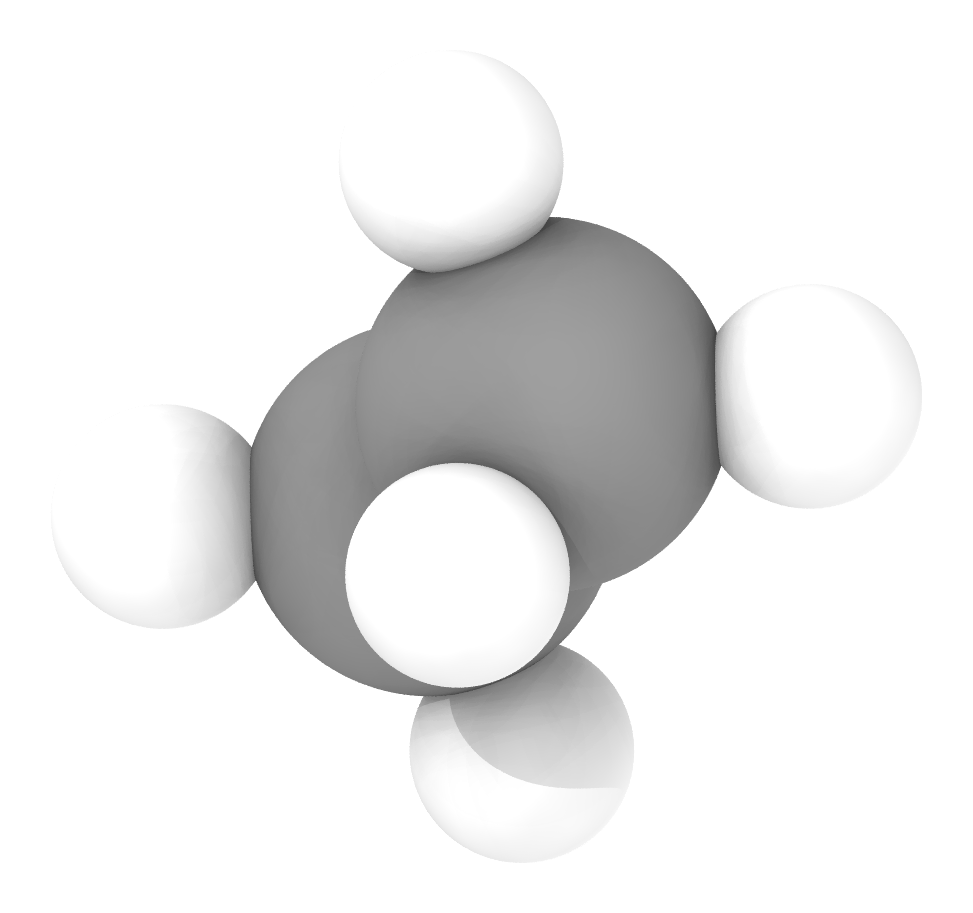
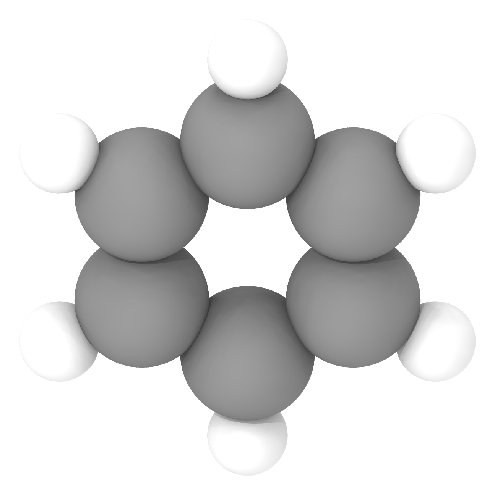
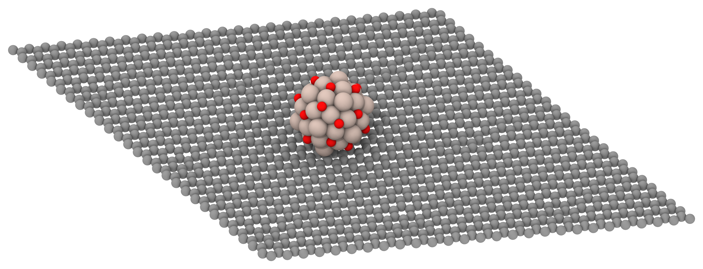
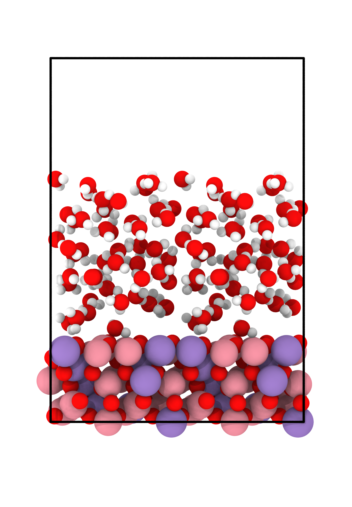

# agent-skills

AI agent skills for research and everyday life.

Built for [Claude Code](https://claude.ai/code), but the core scripts are LLM-agnostic Python.

## Installation

Just tell Claude Code:

> "Install all skills from https://github.com/JinukMoon/agent-skills into my skills."

Claude Code will clone this repo and copy the skills to `~/.claude/skills/`.

Each skill's `SKILL.md` contains its own setup guide (Python dependencies, renderer selection, etc.).
On first use, each skill asks once for any personal settings it needs (paths, author info, etc.)
and stores them locally on your machine — no personal data lives in this repo.

## Available Skills

### Research

| Skill | Description |
|-------|-------------|
| [structure-visualizer](skills/research/structure-visualizer/) | Render atomic/molecular structures as publication-quality PNG (OVITO Tachyon / POV-Ray) |
| [pptx-to-pdf](skills/research/pptx-to-pdf/) | Convert PPTX to PDF by rasterizing each slide as a 7K image — renders identically on any machine regardless of installed fonts |
| [paper-reading](skills/research/paper-reading/) | Deep-read a scientific paper PDF and produce full Korean translation + critical review |
| [pre-proof](skills/research/pre-proof/) | Final proofreading / anomaly hunt for manuscripts before submission (10-pass checker) |
| [scientific-paper-coach](skills/research/scientific-paper-coach/) | Review or write scientific manuscripts against a 200+-item academic-writing checklist (distilled from an SNU scientific-writing course) — PASS/FAIL review mode + checklist-first write mode |

### Life

| Skill | Description |
|-------|-------------|
| [snu-tennis-reserve](skills/life/snu-tennis-reserve/) | Auto-grab SNU tennis court reservations the moment they open (Monday 9:30 KST) via Playwright |
| [snu-etl-video-downloader](skills/life/snu-etl-video-downloader/) | Download SNU eTL/LCMS lecture videos by content_id (parallel, with failure detection) |
| [whisper-transcribe](skills/life/whisper-transcribe/) | Transcribe lecture videos to text with OpenAI Whisper (ffmpeg extraction + GPU pipeline, battle-tested pitfalls included) |

## Examples (structure-visualizer)

### Molecules

| H2O | NH3 | CH4 | CO2 | C2H6 |
|:---:|:---:|:---:|:---:|:---:|
|  |  |  |  |  |

| C2H4 | C6H6 | CH3OH | HCOOH | CH3CHO |
|:---:|:---:|:---:|:---:|:---:|
|  |  |  |  |  |

### Slabs & Surfaces

| Ru55O20 / graphene | Ru309O52 / graphene |
|:---:|:---:|
|  |  |

| ZnO + water | Co2MnO4 + water |
|:---:|:---:|
|  |  |

## License

MIT
