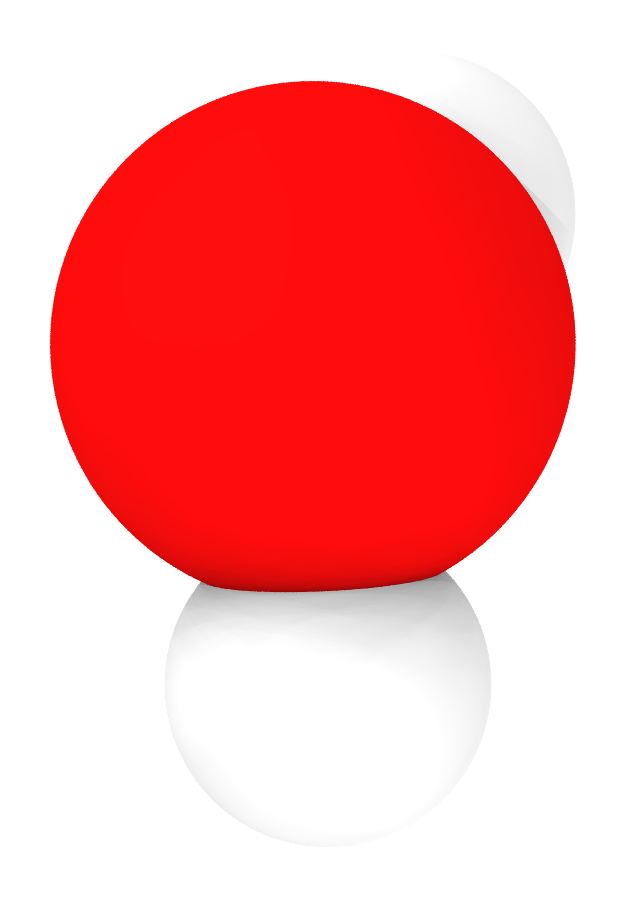
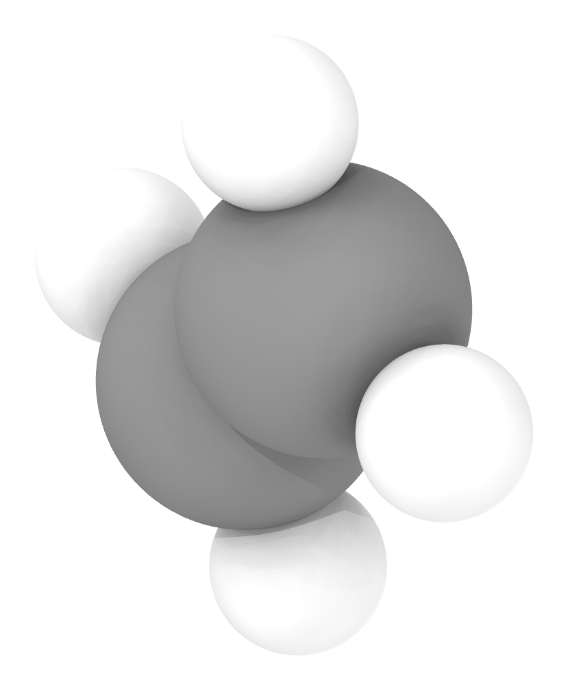
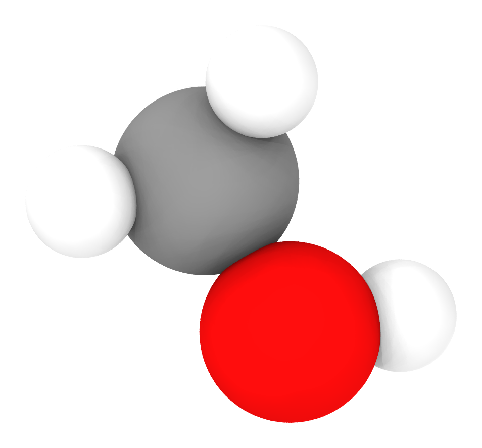
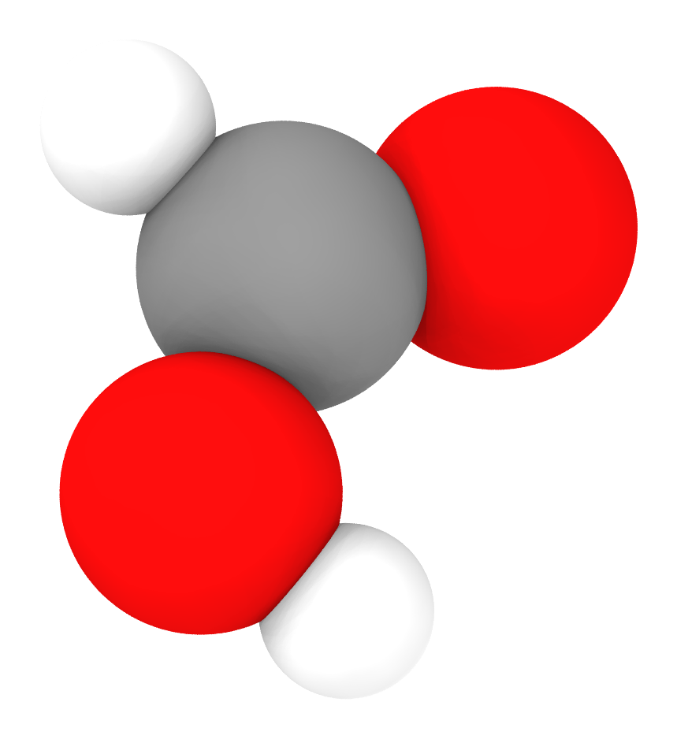
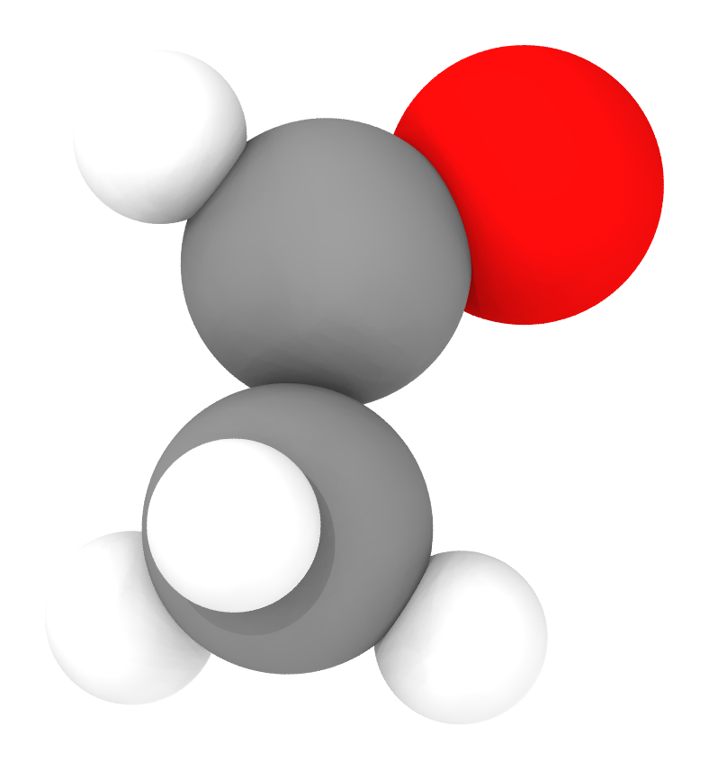

# agent-skills

AI agent skills for computational chemistry and materials science research.

Built for [Claude Code](https://claude.ai/code), but the core scripts are LLM-agnostic Python.

## Available Skills

| Skill | Description |
|-------|-------------|
| [structure-visualizer](skills/structure-visualizer/) | Render atomic/molecular structures as publication-quality PNG (OVITO Tachyon / POV-Ray) |

## Examples (structure-visualizer)

Rendered with OVITO Tachyon, transparent background:

| H2O | NH3 | CH4 | CO2 | C2H6 |
|:---:|:---:|:---:|:---:|:---:|
|  |  |  |  |  |

| C2H4 | C6H6 | CH3OH | HCOOH | CH3CHO |
|:---:|:---:|:---:|:---:|:---:|
|  |  |  |  |  |

## Installation

Just tell Claude Code:

> "https://github.com/JinukMoon/agent-skills 에서 structure-visualizer 스킬 설치해줘"

Claude Code will clone this repo and copy the skill to `~/.claude/skills/`.

Each skill's `SKILL.md` contains its own setup guide (Python dependencies, renderer selection, etc.).

## License

MIT
